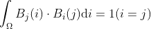
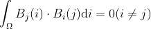

# Precomputed Radiance Transfer (PRT)

## Setup

**Operating & compiling environment**:

* **Real-time**: Visual studio code (Windows 11) & Live server
* **Precompute**: Cmake & Visual studio 2022 (Windows 11)

**Framework**:

* WebGL
* [Nori](https://github.com/wjakob/nori)

## Spherical Harmonics

### Defination:

### Properties:

1. **Orthogonality**

   For Basis functions $B(i)$

   
    

   
    

   
2. **Rotationally invariant**

## Precompute Radiance Transfer

$$
L(o) = \rho \int_{\Omega}L(i)V(i)max(0,n \cdot i)\mathrm{d}i
$$

**Spherical harmonic coefficient**: **Environmental light** & **Light transport**

## Pipeline

### Precompute:

#### Calculate the Spherical harmonic coefficient in Nori

**Environmental light:**

Riemann integral 

**Light transport:**

Diffuse unshadowed

Diffuse shadowed

Diffuse interreflection

### Real time:

#### Render the scene with light.txt and transport.txt from Nori.

### Environmental light spherical harmonic rotation

## Result

<table>
    <tr>
        <th colspan="1">Precompute Radiance Transfer</th>
    </tr>
    <tr>
        <td >
Precompute Radiance Transfer by Nori 
</td>
    </tr>

<table>
    <tr>
        <th colspan="1">Interreflection with 3 bounces</th>
        <th colspan="1">Shadowed</th>
    </tr>
    <tr>
        <td >
Grace Cathedral Interreflection
</td>
        <td >
Grace Cathedral Shadowed
</td>
    </tr>
    <tr>
        <td >
Indoor Interreflection
</td>
        <td >
Indoor Shadowed
</td>
    </tr>
    <tr>
        <td >
Sky Box Interreflection
</td>
        <td >
Sky Box Shadowed
</td>
    </tr>
    <tr>
        <td >
Cornell Box Interreflection
</td>
        <td >
Cornell Box Shadowed
</td>
    </tr>

<table>
    <tr>
        <th colspan="2">Environmental light spherical harmonic rotation</th>
    </tr>
    <tr>
        <td >
Grace Cathedral
</td>
    </tr>
    <tr>
        <td >
Indoor
</td>
    </tr>
    <tr>
        <td >
Sky Box
</td>
    </tr>
    <tr>
        <td >
Cornell Box
</td>
    </tr>

